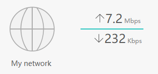

# Networking Beginner vs Nintendo Switch
Yesterday, I had to change my home WiFi and update all the devices at home to point to the new network. It was a pretty fun experience.

<!-- more -->

## But why?

My wife has been streaming on **Twitch** for some months. She mostly streams [Pokemon UNITE](https://unite.pokemon.com/) during the night, so there's not much other network activity going on at home. In the last month or so, she has been experiencing a lot of lag while playing, sometimes freezing her for a couple seconds.

We had been trying to figure out what was the issue, other devices consuming the bandwidth? Looking at the network usage, I saw nothing that would indicate so.

/// caption
Given that our available bandwidth is symmetrical 700 Mbps, I didn't think that was the problem.
///

Checking SpeedTest in our computers would give us around 150 Mbps symmetrical (I really wish we used ethernet...)... so I still didn't think this was the issue.

It wasn't until I noticed that her Nintendo Switch was connecting to the **2.4 GHz** band, instead of the **5 GHz** one, even if I moved centimeters away from the router, and speed tests on it wouldn't even reach 10 Mbps, so I figured it was something related to that. Our Nintendo Switches were able to see other **5 GHz** networks, but when connecting to our (combined) network, it would never use the 5 GHz band.

## Network Setup

Some months after we moved into our house, we were using the router provided by our ISP, which was decent, but coverage on the second floor wasn't so good. I figured it was time to buy my own router. I didn't buy anything fancy, I went with a [Huawei WiFi AX3](https://consumer.huawei.com/en/routers/ax3/).

I must add that, due to our current house layout, we are not using ethernet (*I know... I know...*). That will change once we are able to build our office/game room, but that's another story.

I installed it, configured, loved it. I thought, now if I switch ISPs or they need to change my router for some reason, I don't have to do any changes in my devices, since they will always be connected to the router. Or at least that's what I thought...

I have always been a bit annoyed by routers having two SSID, one for 2.4 GHz and one for 5 GHz, because you see twice as many networks everywhere, so when I saw the option to have a single SSID that offers both, I immediately turned that on. It was pretty nice, my phone wouldn't randomly lose WiFi on the second floor because it lost connection to the 5 GHz and connected to the 2.4 GHz one. Changing it required reconnecting every device at home to the new network, once again... but I figured it was worth it.

The change was a bit harder on some IoT devices, like lightbulbs, because they can only connect to 2.4 GHz, so some would keep saying it was a 5 GHz network.

## Finding a solution

The first step was to again split the WiFi network into separate SSIDs for each band. I dusted off my old laptop and opened my cable drawer to get one of the many ethernet cables. I did the change, and just for fun, I ran speedtest while I was connected to the router through ethernet to see what I was missing.

/// caption
Sometimes I just sit and think about what could've been...
///

I wiped the single tear out of my face and continued my work... I grabbed my Switch and I noticed I was still not seeing the 5 GHz network... but I still could see other networks, and my phone was able to see and connect to my 5 GHz network. I also tried the "Backup Wi-Fi 5" option, which creates Wi-Fi 5 networks for devices that can't discover **Wi-Fi 6** networks, but no luck.

So it was time to resort to Google to find a solution. Oddly enough I ended up finding some answers in a [deals community](https://www.promodescuentos.com/discusiones/problemas-5g-switch-oled-jpn-840838) (Mexican version of [Pepper](https://www.pepperdeals.com/)). Basically the issue was that Nintendo Switch can only see WiFi **channels under 149**, and my router was using exactly **channel 149**.

I changed that to **channel 36**, and some seconds later, the 5 GHz network showed up on my Switch. I connected to it and ran a speedtest from my Switch, and got around 30 Mbps. Not quite what I expected... but I guess I cannot ask much from Nintendo, so I considered that a win.

I wrapped everything up, set up every device in my house to connect to the new network, grumbling my way through the process.

Later that night, my wife tested Pokemon Unite again, and her lag problem was finally solved.

## Final thoughts

Turns out the real problem wasn’t bandwidth, or interference, or streaming — it was just the Switch being picky about WiFi channels.

Annoying? Yes.  
Fixable? Also yes.  
And now we can play and stream in peace.

For now.

*[SSID]: Service Set Identifier — the name of a Wi-Fi network.
*[Wi-Fi 6]: A newer Wi-Fi standard offering better performance and efficiency compared to Wi-Fi 5.
