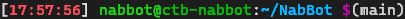

# Terminal
## Style Terminal

Colors the command line to make the start of one command easier to find.


Add this to `.bashrc`:

```sh
export PS1="[\[$(tput sgr0)\]\[\033[38;5;9m\]\t\[$(tput sgr0)\]\[\033[38;5;15m\]] \[$(tput sgr0)\]\[\033[38;5;10m\]\u@\[$(tput sgr0)\]\[\033[38;5;34m\]\h\[$(tput sgr0)\]\[\033[38;5;15m\]:\[$(tput sgr0)\]\[\033[38;5;39m\]\w\[$(tput sgr0)\]\[\033[38;5;15m\] \[$(tput sgr0)\]\[\033[38;5;13m\]\\$\[$(tput sgr0)\]"
```

Make sure that this line is uncommented:

```sh
force_color_prompt=yes
```

!!! example "Preview"

    

## Show current git branch
Add this to `.bashrc`:

```shell
git_branch() {
  git branch 2> /dev/null | sed -e '/^[^*]/d' -e 's/* \(.*\)/(\1)/'
}

export PS1=$PS1"\$(git_branch)"
```

!!! example "Preview"

    
    
    *Any other customizations will be preserved.*

## Useful aliases

Activate the [venv](https://docs.python.org/3/library/venv.html) in the current directory.

```shell
alias activenv="source venv/bin/activate"
```

## Favorite Tools

| Tool                                  | Description                                                 | Installation       |
| ------------------------------------- | ----------------------------------------------------------- | ------------------ |
| [bat](https://github.com/sharkdp/bat) | A `cat` clone with syntax highlighting and Git integration. | `apt install bat`  |
| [ncdu](https://dev.yorhel.nl/ncdu)    | Disk usage analyzer with a text user interface.             | `apt install ncdu` |


## Laptop as a server

Small tweaks to I did on my laptop to make it a bit more reliable:

Make sure this lines are set in `/etc/systemd/logind.conf`

```shell
HandleLidSwitch=ignore
HandleLidSwitchExternalPower=ignore
HandleLidSwitchDocked=ignore
```

Disable suspend completely:

```
sudo systemctl mask sleep.target suspend.target hibernate.target hybrid-sleep.target
```