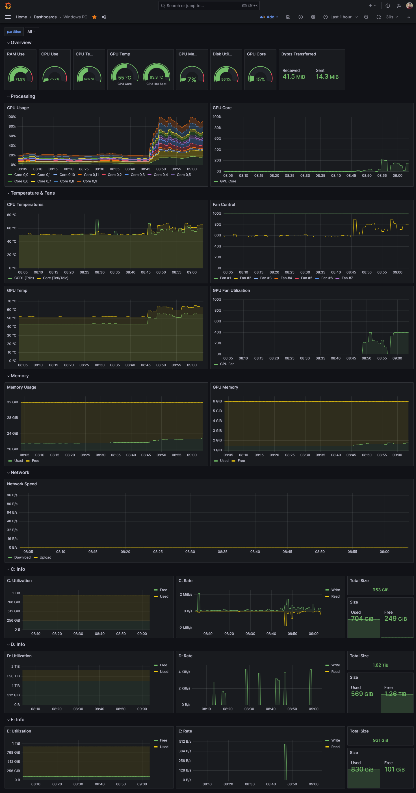

# Home PC Monitoring
This is a simple project that that uploads metriics from my PC and Rasberry PI to my Grafana account.

## Rasberry Pi Host
This will be the device that will collect the metrics of other devices in the network to upload them to Grafana.com.

I use the following `docker-compose.yml` file:

```yaml
version: "3.8"

services:
  grafana-agent:
    image: grafana/agent:v0.32.0
    volumes:
      - /tmp/agent:/etc/agent
      - ./agent.yaml:/etc/agent-config/agent.yaml
      - /var/log/:/var/log/
    command: -config.file=/etc/agent-config/agent.yaml -config.expand-env
    env_file:
      - ./auth.env
    restart: always

  rpi-exporter:
    image: carlosedp/arm_exporter
    restart: always
```

!!! note

    At the moment of writing this, `0.32.0` was the latest Docker image version that was compatible with `armv7`.

On that same directory, we need a `auth.env` file with the following:

```properties
PROMETHEUS_USER=12345678
API_KEY=dGhpcyBpcyBub3QgYW4gYWN0dWFsIEFQSSBrZXk=
```

These values are all obtained from your account in Grafana.com.

Additionally, we have the configuration file for the agent:

```yaml
integrations:
  node_exporter:
    enabled: false
  prometheus_remote_write:
    - basic_auth:
        password: ${API_KEY}
        username: ${PROMETHEUS_USER}
      url: https://prometheus-us-central1.grafana.net/api/prom/push


metrics:
  configs:
    - name: integrations
      remote_write:
        - basic_auth:
            password: ${API_KEY}
            username: ${PROMETHEUS_USER}
          url: https://prometheus-us-central1.grafana.net/api/prom/push
      scrape_configs:
        - job_name: rpi-exporter
          static_configs:
            - targets:
              - rpi-exporter:9243
        - job_name: <job-name-for-pc-job>
          static_configs:
            - targets:
              - 192.168.1.1:4445 # OhmGraphite
              - 192.168.1.1:9182 # windows_exporter
```

## Windows Devices
On Windows devices, I use two tools:

### [OhmGraphite](https://github.com/nickbabcock/OhmGraphite)

This collects hardware sensor data, such as CPU and GPU temperatures. I use it in [Prometheus mode](https://github.com/nickbabcock/OhmGraphite#prometheus-configuration)

### [windows_exporter](https://github.com/prometheus-community/windows_exporter)

Collects general information from Windows machine, similar to [node_exporter](https://github.com/prometheus/node_exporter).


## Raspberry Pi Devices

Configuration for additional Raspberry PI devices coming soon.


## Grafana Dashboards

